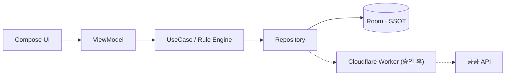

# 차근

> 내 차를 차근차근 관리해요

공식 자동차 정보와 사용자의 관리 기록을 한곳에 모아 현재 차량 상태와 다음 정비·검사·리콜 일정을 계산하는 **로컬 우선 개인 차량 관리 Android 앱**입니다. 필요할 때 차량 정보를 사용자가 쓰는 AI(ChatGPT·Claude·Gemini)로 안전하게 전달합니다.

## 핵심 기능

| 영역 | 내용 |
|---|---|
| 차량 등록 | 수동 등록 (V1). 차량번호 자동 조회는 공공 API 승인 후 연동 예정 ([ADR-004](docs/adr/ADR-004-v1-manual-registration.md)) |
| 상태 판단 | 결정론적 정비 Rule Engine — 거리·기간 중 먼저 도달하는 기준, 정보 부족은 `정상`으로 표시하지 않음 |
| 기록 | 정비·주유·점검·검사·리콜을 하나의 Timeline으로, 사진·영수증 첨부 |
| 알림 | WorkManager 기반 로컬 알림, 해당 상세 화면으로 Deep Link |
| 데이터 출처 | 공식 / 사용자 입력 / 앱 계산을 Badge와 갱신 시각으로 구분 |
| AI 공유 | Context Preview에서 포함 정보를 확인한 뒤 Sharesheet로 전달, 차량번호·소유주명은 기본 제외 |
| 데이터 관리 | ZIP 내보내기·가져오기(실패 시 기존 데이터 유지)·전체 삭제, 앱 내 개인정보 안내와 오픈소스 라이선스 고지 |
| 광고 | 홈·관리·기록에만 Native 광고 1칸, 차량 등록 후 2회째 실행부터, UMP 동의 반영. 온보딩·입력·검사·리콜·AI 화면에는 없음 (현재 테스트 광고 ID) |
| Adaptive UI | Window Size Class 기반 Phone · Fold(Book/Tabletop) · Tablet 1~3 Pane |

## 기술 스택

Kotlin · Jetpack Compose · Material 3 Adaptive · Navigation 3 · Hilt · Coroutines/Flow · Room · DataStore · WorkManager · kotlinx.serialization · Roborazzi · Macrobenchmark

## 아키텍처



- UI는 Room을 관찰하고 네트워크 결과를 직접 기다리지 않습니다. ([ADR-001](docs/adr/ADR-001-local-first-room.md))
- 공공 API Key는 APK가 아닌 Worker Secret에만 존재합니다. ([ADR-002](docs/adr/ADR-002-public-api-proxy-worker.md)) V1은 공식 데이터 없이 출시하며 Worker는 API 승인 후 연동합니다. ([ADR-004](docs/adr/ADR-004-v1-manual-registration.md))
- 정비 Rule Engine은 Android Framework와 분리된 Pure Kotlin입니다.

## 시작하기

요구사항: Android Studio (JDK 21), Android SDK 36

```bash
git clone https://github.com/Naury74/ChaGeun.git
./gradlew assembleDebug
```

## 품질 검사

```bash
./gradlew ktlintCheck detekt lintDebug testDebugUnitTest verifyRoborazziDebug assembleDebug
```

PR마다 GitHub Actions에서 동일한 검사가 실행됩니다. 의도한 UI 변경이면 `./gradlew recordRoborazziDebug`로 기준 Screenshot(`feature/*/src/test/screenshots`)을 갱신해 같은 PR에 포함합니다.

### 성능

```bash
./gradlew :app:generateReleaseBaselineProfile          # Baseline Profile 생성 → app/src/release/generated
./gradlew :benchmark:pixel6Api34BenchmarkReleaseAndroidTest  # Cold Start · 목록 Scroll Macrobenchmark
```

Gradle Managed Device(Pixel 6, API 34 ATD)에서 실행하며, Nightly Workflow가 매일 측정 결과를 Artifact로 남깁니다. 에뮬레이터 수치는 큰 회귀를 잡는 용도이고, 비교는 같은 실기기에서 합니다.

## 문서

- [Contributing](CONTRIBUTING.md) — Branch · Commit · PR · 주석 규칙
- [Security](SECURITY.md) — 민감 데이터와 Secret 운영
- [ADR](docs/adr) — 주요 기술 결정
- 진행 상황은 [Issues](https://github.com/Naury74/ChaGeun/issues)와 [Milestones](https://github.com/Naury74/ChaGeun/milestones)에서 관리합니다.
